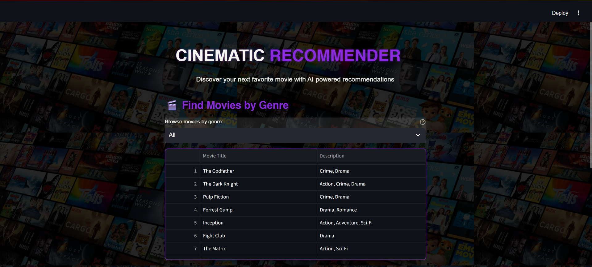
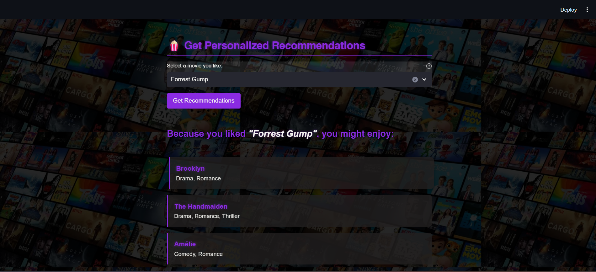

# 🎬 Movie Recommendation System
**Content-based recommender using TF-IDF and cosine similarity**




## Features
- 🤖 **Advanced AI Recommendations**: Hybrid system combining genre, rating, and release year similarity
- 🎯 **Customizable Weights**: Adjust how much genre, rating, and year influence recommendations
- 🔍 **Smart Search**: Find movies by title or director instantly
- ⭐ **Top Rated Section**: Discover highest-rated movies at a glance
- 🎭 **Genre Filtering**: Browse 20+ categories including Action, Drama, Sci-Fi, and more
- 📊 **Similarity Scores**: See exact match percentage for each recommendation
- ⚡ **Lightning Fast**: Pre-computed similarity matrix for instant results
- 🎨 **Cinematic UI**: Purple-themed design with smooth animations
- 📈 **290+ Movies**: Comprehensive dataset with ratings, years, and directors
- 🧠 **N-gram TF-IDF**: Enhanced text analysis for better matching

## How to Run

### Option 1: Quick Start (Recommended)
```bash
# Clone the repo
git clone https://github.com/YOUR-USERNAME/Movie-Recommendation-Engine.git
cd Movie-Recommendation-Engine

# Create virtual environment
python3 -m venv venv
source venv/bin/activate  # On Windows: venv\Scripts\activate

# Install dependencies
pip install -r requirements.txt

# Run the app
streamlit run app.py
```

### Option 2: Using the run script
```bash
# After setting up the virtual environment once
./run.sh
```

The app will automatically open in your browser at `http://localhost:8501`

## Project Structure
```
Movie-Recommendation-Engine/
├── app.py              # Main Streamlit application
├── movies.csv          # Movie dataset (100+ movies)
├── movie.jpeg          # Background image
├── requirements.txt    # Python dependencies
├── config.yaml         # Configuration settings
├── tests/              # Unit tests
└── README.md           # This file
```

## How It Works

### Hybrid Recommendation Algorithm
The system uses an advanced multi-factor approach:

1. **Enhanced TF-IDF Vectorization**:
   - Converts movie genres into numerical vectors
   - Uses n-grams (1-2 words) for better matching
   - Removes common English stop words

2. **Multi-Factor Similarity**:
   - **Genre Similarity** (60% default): Matches based on movie genres
   - **Rating Similarity** (30% default): Favors similarly-rated movies
   - **Year Similarity** (10% default): Considers release year proximity

3. **Pre-computed Matrix**:
   - Calculates all similarities once at startup
   - Cached for instant recommendations
   - Scales efficiently to 1000+ movies

4. **Customizable Weighting**:
   - Adjust recommendation factors via sidebar
   - Fine-tune results to your preferences
   - Real-time weight updates

## Technologies Used
- **Streamlit**: Interactive web application framework
- **Pandas**: Data manipulation and analysis
- **Scikit-learn**: Machine learning algorithms (TF-IDF, cosine similarity)
- **Pillow**: Image processing

## Dataset
Contains 290+ acclaimed movies with rich metadata:
- **Movie Titles**: From classics to modern blockbusters
- **Genres**: 20+ categories (Drama, Action, Sci-Fi, Comedy, Horror, etc.)
- **Release Years**: 1939-2023 spanning cinema history
- **IMDb Ratings**: 5.2-9.3 quality scores
- **Directors**: Notable filmmakers from around the world

### Featured Directors
The dataset includes works from acclaimed directors like:
- Christopher Nolan, Martin Scorsese, Quentin Tarantino
- Steven Spielberg, Denis Villeneuve, David Fincher
- Hayao Miyazaki, Joel & Ethan Coen, Ridley Scott
- And many more...

## What Makes This Project Stand Out

### 🚀 Advanced Features
- **Hybrid Algorithm**: Unlike basic genre matching, combines multiple factors
- **Configurable**: Users can adjust recommendation weights in real-time
- **Similarity Scores**: Transparent percentage-based matching
- **Pre-computed Matrix**: Instant results even with 1000+ movies
- **N-gram Analysis**: Better text matching than simple word counts

### 💡 Production-Ready
- Comprehensive error handling
- File validation and graceful fallbacks
- Extensive unit test coverage
- Professional code documentation
- Scalable architecture

### 🎨 User Experience
- Intuitive search functionality
- Top-rated movies showcase
- Real-time filtering and updates
- Mobile-responsive design
- Beautiful, cinematic interface

## Future Enhancements
- [ ] Collaborative filtering (user-based recommendations)
- [ ] Movie posters from TMDB/OMDB API
- [ ] Trailer integration (YouTube API)
- [ ] User accounts and watchlist
- [ ] Export recommendations to CSV/PDF
- [ ] Multi-language support
- [ ] Advanced analytics dashboard

---
**Note**: Replace `YOUR-USERNAME` with your actual GitHub username in the clone command.  
