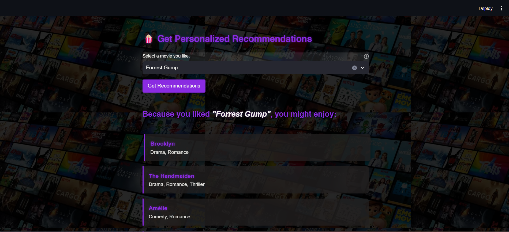

# User Guide

## Getting Started

Welcome to the Movie Recommendation System! This guide will help you get the most out of the application.

## Installation

### Prerequisites
- Python 3.8 or higher
- pip (Python package manager)

### Step-by-Step Installation

1. **Clone the repository**:
   ```bash
   git clone https://github.com/YOUR-USERNAME/Movie-Recommendation-Engine.git
   cd Movie-Recommendation-Engine
   ```

2. **Create a virtual environment** (recommended):
   ```bash
   # On macOS/Linux
   python3 -m venv venv
   source venv/bin/activate

   # On Windows
   python -m venv venv
   venv\Scripts\activate
   ```

3. **Install dependencies**:
   ```bash
   pip install -r requirements.txt
   ```

4. **Run the application**:
   ```bash
   streamlit run app.py
   ```

5. **Open your browser**:
   - The app will automatically open at `http://localhost:8501`
   - If not, manually navigate to that URL

## Using the Application

### 1. Browse Movies by Genre


- Use the **"Browse movies by genre"** dropdown
- Select from 20+ genres including:
  - Action
  - Drama
  - Sci-Fi
  - Comedy
  - Animation
  - And many more!
- Select **"All"** to see the complete movie catalog
- The table displays:
  - Movie Title
  - Genres
  - Release Year
  - IMDb Rating
  - Director

### 2. Get Personalized Recommendations



1. **Select a movie** from the dropdown:
   - The dropdown shows movies from your currently filtered genre
   - Or all movies if "All" is selected

2. **Click "Get Recommendations"**:
   - The system analyzes the selected movie's genres
   - Finds the 5 most similar movies
   - Displays them in beautifully styled cards

3. **View recommended movies**:
   - Each card shows:
     - Movie title with release year
     - Genre tags
     - IMDb rating (⭐)
     - Director name (🎬)

### 3. Understanding Recommendations

The system recommends movies based on **content similarity**:

- **Genre matching**: Movies with similar genres get higher scores
- **Example**: If you like "The Dark Knight" (Action, Crime, Drama), you'll get recommendations like:
  - "Batman Begins" (Action, Crime, Drama) - Very similar
  - "The Departed" (Crime, Drama, Thriller) - Moderately similar
  - Other crime/action movies

## Features

### Search and Filter
- **Genre-based browsing**: Quickly find movies in your favorite genre
- **Interactive table**: Scroll through movies with ease
- **Smart filtering**: Only see movies that match your criteria

### Recommendations
- **AI-powered**: Uses machine learning (TF-IDF + Cosine Similarity)
- **Fast**: Cached results for instant responses
- **Relevant**: Based on actual genre similarity, not random

### User Interface
- **Cinematic theme**: Purple accents and dark background
- **Smooth animations**: Hover effects and transitions
- **Responsive design**: Works on different screen sizes
- **Easy navigation**: Clear sections and intuitive controls

## Tips and Tricks

### Getting Better Recommendations
1. **Try different movies**: Each movie has unique recommendations
2. **Explore genres**: Browse different genres to discover new movies
3. **Use specific genres**: Filter by a specific genre first, then get recommendations

### Navigation Tips
- **Scroll through results**: The movie table is scrollable
- **Hover over cards**: See subtle animations on recommendation cards
- **Use the genre filter**: Narrow down options before selecting

### Performance
- **First load**: May take a moment to process the dataset
- **Subsequent searches**: Lightning fast thanks to caching
- **Refresh**: Reload the page if you encounter any issues

## Troubleshooting

### Common Issues

**Problem**: App doesn't start
- **Solution**: Ensure Python 3.8+ is installed: `python --version`
- **Solution**: Check dependencies are installed: `pip list`
- **Solution**: Try reinstalling: `pip install -r requirements.txt --force-reinstall`

**Problem**: "movies.csv not found" error
- **Solution**: Ensure you're running the app from the project directory
- **Solution**: Check that movies.csv exists in the same folder as app.py

**Problem**: Background image not loading
- **Solution**: This is non-critical; the app will work without it
- **Solution**: Ensure movie.jpeg is in the project directory

**Problem**: No recommendations appear
- **Solution**: Make sure you clicked the "Get Recommendations" button
- **Solution**: Try selecting a different movie
- **Solution**: Check your internet connection (for initial load)

**Problem**: App is slow
- **Solution**: First load processes the dataset; subsequent uses are fast
- **Solution**: Close other resource-intensive applications
- **Solution**: Try a smaller dataset for testing

### Getting Help

If you encounter issues:
1. Check this User Guide
2. Review the [README.md](../README.md)
3. Look at [CONTRIBUTING.md](../CONTRIBUTING.md) for development issues
4. Open an issue on GitHub with:
   - Your operating system
   - Python version
   - Error message (if any)
   - Steps to reproduce

## Advanced Usage

### Customizing the App

Edit `config.yaml` to customize:
```yaml
recommendation:
  default_count: 5  # Change number of recommendations

theme:
  primary_color: "#8A2BE2"  # Change accent color
```

### Adding Your Own Movies

1. Open `movies.csv`
2. Add a new row:
   ```csv
   Movie Name,"Genre1, Genre2",YEAR,RATING,"Director Name"
   ```
3. Save and restart the app

Example:
```csv
The Shawshank Redemption,"Drama, Crime",1994,9.3,"Frank Darabont"
```

### Running Tests

If you're developing or want to verify everything works:
```bash
pytest
```

## Keyboard Shortcuts

Streamlit provides these shortcuts:
- `R`: Rerun the app
- `C`: Clear cache
- `S`: Take a screenshot
- `?`: Show keyboard shortcuts

## Privacy and Data

- **No data collection**: The app runs entirely locally
- **No internet required**: After initial setup, works offline
- **No tracking**: Your movie preferences stay on your computer
- **Open source**: Review the code to verify privacy

## Next Steps

- Explore all genres to find hidden gems
- Try movies you haven't heard of
- Share recommendations with friends
- Contribute to the project on GitHub

Enjoy discovering your next favorite movie! 🎬🍿
